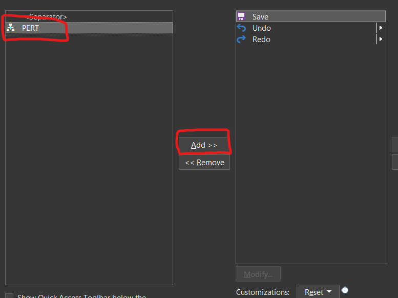

# MSProject-2019-PERT
Contains the macro for running PERT Analysis in Microsoft Project 2019

## How to Use

### Seting up the macro
Step 1. Open a New Project inside MS Project 2019  
Step 2. Go to **View > Macros (Dropdown) > Visual Basic**  
  
Step 3. Select **ThisProject(Global.MPT)** From **Microsoft Project Objects** under **ProjectGlobal(Global.MPT)** (We are using global so that we can use this macro on all future projects without having to readd to them)  
  
Step 4. Paste the code from **[the github file here](./PERTmacro.vba)** ([Raw can be found here](https://raw.githubusercontent.com/flametron/MSProject-2019-PERT/main/PERTmacro.vba)) into the codebox that opens (append to the end if some code is already present there)  
  
Step 5. Hit **Save** from either the **toolbox** or Going to **File > Save Global.MPT** or just hit **Ctrl + S** And close the Microsoft Visual Basic for Applications window  

### Adding the button
Step 1. Click on **Customize Quick Access Toolbar** (Top Left Corner of Project Window)

Step 2. Go to **More Commands...**  
  
Step 3. Select **Macros** from the **Choose Commands from** dropdown  
  
Step 4. Select **PERT** and click on **Add >>**  (Make sure the **Customize Quick Access Toolbar** dropdown is selected to **For all documents**)
  
Step 5. You Should have **PERT** into the **Quick Access Toolbar _For all documents_**  
  
Step 6. Hit **OK**  
Step 7. Now you have a button in the **Quick Access Toolbar** (on hovering the tooltip says _PERT_)  

## Acknowledgements

Used a bit of code snippet from [This StackOverflow answer by dbmitch](https://stackoverflow.com/a/51144941/8791515)  
Based on [This Microsoft Blog](https://docs.microsoft.com/en-us/archive/blogs/projectified/three-point-estimation-pert-in-project-2010-take-1)
